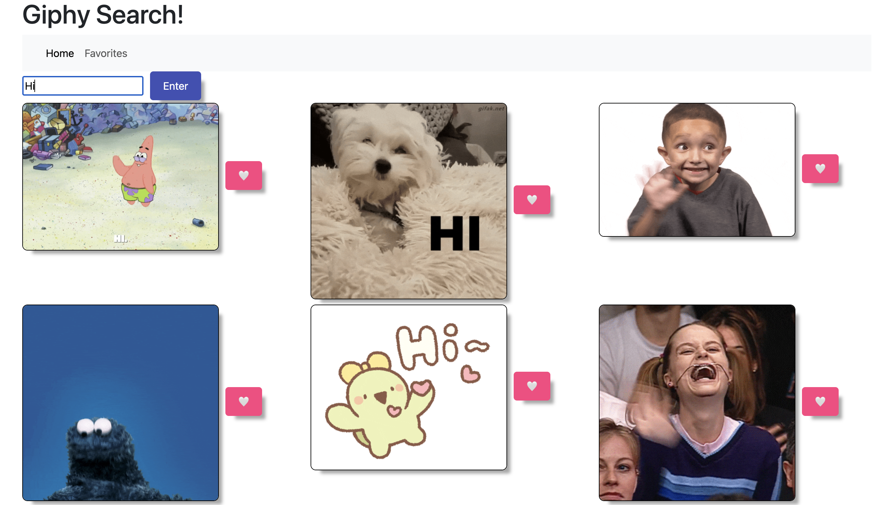
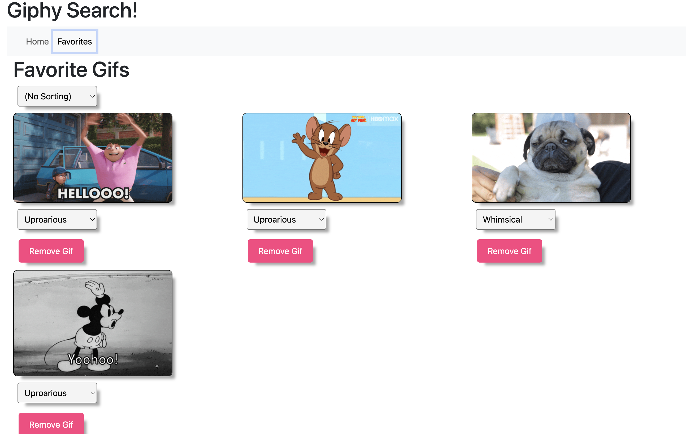

# Group Giphy Saga Project: Search and Favorites

This website allows the user to search gifs using the Giphy API, favorite gifs, as well as sort gifs into different catagories.

## Setup

See the `database.sql` file for database setup and details. It offers some of the SQL to get you started but you'll need to set up your tables and the relationships between them.

- Run `npm install`.
    - Be sure to take stock of `package.json` to see which dependencies you'll need to add.
- Start postgres if not running already by opening up the [Postgres.app](https://postgresapp.com), or if using [Homebrew](https://brew.sh) you can use the command `brew services start postgresql`.
- Run `npm run server` to start the server.
- Run `npm run client` to start the client.
- Navigate to `localhost:5173`.

You will also need to setup a database called 'alex' or you can change it to whatever you want by going to `/server/module/pool.js on line 31` as well as copy, paste and run the code in the database.sql file into your database.

### Search View

- Allows a user to enter a search string and submit a search request.
- Querys the `Giphy API Search Endpoint` with the given search string **FROM THE SERVER**.
- Displays the results on the DOM.
- Allows a user to "favorite" any of the resulting images.

### Favorites View

- Allow a user to see all of the Giphy images they have made a favorite. The actual images need to appear on the DOM.
- Allow a user to set a category for a favorite image.
    - Each favorite image can only have one category at a time.
    - The category needs to be one of the categories in the database.

